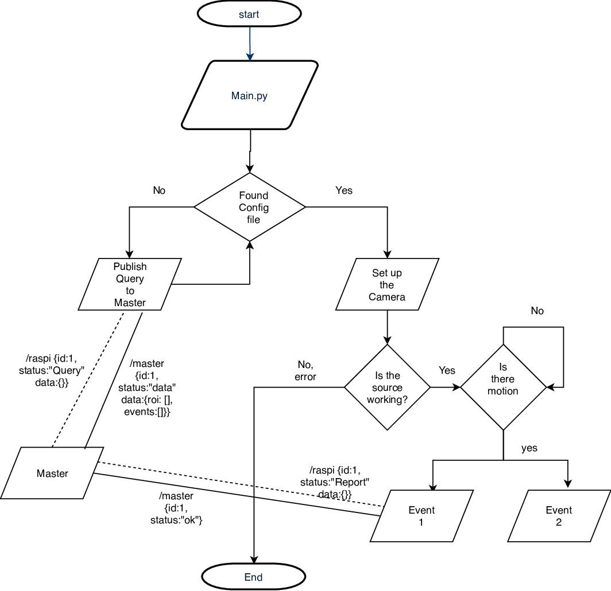

# Raspberry Pi Event Detection

This project deals with detecting events in the scene using multiple raspberry Pis. The general setup, backend processes and "how-to" is described in this readme. Please note that there will not be any requirements file for this project since the setup process for a raspberry Pi is much different than that on a PC.


## Defining an event

The initial thought of event definition was quiet unclear since object motion is an event and so is object removal. However to narrow things down we define two major types of events:
1. Binary Events
	* Object Removal
	* Object Introduction

2. Sequential Events
	* Robot Arrival
	* Robot Departure
	* Object pick
	* Object place

Any of the aforementioend event has got one common trigger: The motion trigger. Whenever we have a motion (major noise in a binary frame) we spawn the events realted to motion trigger. Most of them are included within the scope of the motion trigger. However we can add more triggers as the project evolves.

## Modules and organization of the code
```
├── comm.txt
├── communication
│   ├── __init__.py
│   ├── master.py
│   └── slave.py
├── events
│   ├── conf.json
│   ├── cv.py
│   ├── __init__.py
│   ├── key.mp4
│   ├── myfile.xls
│   ├── object_motion.py
│   ├── object_removal.py
│   └── sample1.mp4
├── __init__.py
├── object_detection_module
│   ├── ball_on_table.jpg
│   └── find_white_plate.py
├── organization.txt
├── README.md
└── src
    ├── config.ini
    ├── eventModule.py
    ├── eventModule.pyc
    ├── imageprocessingModule.py
    ├── imageprocessingModule.pyc
    ├── __init__.py
    ├── inputModule.py
    ├── inputModule.pyc
    └── main.py
```

The project has three main modules and one experimental module. The core modules are:
1. communication
2. events
3. src

And the experimental module is:
1. object detection

## Communication Module

This module is responsible for handling Queries from Raspberry Pis to the master which master responds with data for that specific pi and when the Pi detects an event, it sends it to the master in a dictionary format and the master replies an acknoledgement signal.

To achieve we use a PAIR messaging pattern. PAIR has the following charactaristics:
1. Pair offers many-to-one and one-to-many bidirectional communication.
2. There is no specific state stored within the socket.
3. The server listens on a certain port and a client connects to it

[Source: https://learning-0mq-with-pyzmq.readthedocs.io/en/latest/pyzmq/patterns/pair.html]


## Source Module/Folder

The src contains all the submodules required to run the process. It has the following submodules:
1. inputModule: Responsible for setting up the video source and has associated function to get the latest frame.
2. imageprocessingModule: Has basic image processing tools for colorspace conversion, blurs and other sub functions for tranformations.
3. eventModule: Has triggers and other individual classes of events which get spawned when motion trigger is set to true.
4. main: This is the module which binds all other modules and communicates with the master, set up the ROI and reads the config file.

## Object Detection Module

Currently experimental, not integrated with the main files. The idea is to detect each objects and give object level inferences. 

## Algorethmic Walkthrough


